# Comercial 2000 Narón · Demo del proyecto

**Catálogo visual, selección de productos y presencia digital de una tienda de Narón.**

| Dato | Descripción |
| --- | --- |
| Fecha de la demo | 2 de octubre de 2026 |
| Marca | Comercial 2000 Narón |
| Actividad | Equitación, ropa y calzado de trabajo, pieles y complementos |
| Contenido | 34 fichas, seis categorías y ocho imágenes de galería |
| Idioma y moneda | Español de España · EUR |
| Acceso local | [http://localhost:3000](http://localhost:3000), con el servidor en marcha |
| Estado | Demo funcional para explorar y preparar consultas; pago online desactivado |

## Índice

1. [Presentación](#1-presentación)
2. [Instrucciones de ejecución](#2-instrucciones-de-ejecución)
3. [Capturas de las secciones principales](#3-capturas-de-las-secciones-principales)
4. [Funcionalidades](#4-funcionalidades)
5. [Recorrido guiado](#5-recorrido-guiado)
6. [Integración visual con Instagram](#6-integración-visual-con-instagram)
7. [Notas técnicas](#7-notas-técnicas)
8. [Verificación y próximos pasos](#8-verificación-y-próximos-pasos)

## 1. Presentación

Comercial 2000 Narón convierte las fotografías reales de la tienda y su contenido de Instagram en un catálogo organizado y fácil de consultar. La experiencia une productos, servicios, tutoriales, comunidad ecuestre y tienda física.

La identidad visual combina fondos neutros, verde oscuro y botones naranja. La portada destaca una montura real; las fichas presentan el producto completo y la galería aporta contexto del local y de la comunidad.

**Objetivo de la demostración:** recorrer la web, localizar un producto, consultar sus imágenes, preparar una selección y comprobar cómo se plantea una consulta a la tienda. Añadir al carrito no reserva existencias ni confirma un pedido.

## 2. Instrucciones de ejecución

### Requisitos

- Node.js **22 o superior** y npm.
- Navegador moderno.
- No se requieren instalación de dependencias, compilación ni credenciales de pago para la demo.

### Arranque en Windows / PowerShell

Abre una terminal en la carpeta del proyecto o ejecuta:

```powershell
Set-Location "C:\Users\astra\OneDrive\Documentos\mi-proyecto"
node --version
npm start
```

Mantén esa terminal abierta y visita **[http://localhost:3000](http://localhost:3000)**. Para detener el servidor, pulsa **Ctrl + C** en la terminal.

`npm start` ejecuta `node --env-file-if-exists=.env server.mjs`. El archivo `.env` es opcional; no hace falta crearlo para mostrar el catálogo. La configuración de la pasarela y del contacto se explica en [README.md](README.md) y [.env.example](.env.example).

**Importante:** abrir la carpeta en el Explorador de archivos o hacer doble clic en `index.html` no ejecuta la aplicación. Los módulos y la API necesitan el servidor HTTP.

### Comprobaciones

Desde la carpeta del proyecto:

```powershell
npm test
node --check app.js
node --check server.mjs
```

Las pruebas Node verifican lógica comercial, API y recursos; la interfaz se comprueba con el navegador.

## 3. Capturas de las secciones principales

Capturas reales de esta versión, realizadas con Microsoft Edge. Las de escritorio usan un viewport de **1440 × 1000 px** y las de móvil, **375 × 812 px**. Las imágenes de sección abarcan su contenido y ocultan temporalmente la cabecera flotante para evitar superposiciones. La ficha, el carrito y el resumen muestran interacciones reales de demostración.

### 3.1. Portada y navegación

Presenta la marca, la fotografía de montura y los accesos «Explorar productos» y «Conoce nuestros servicios». El aviso informa de que precios y disponibilidad están pendientes.

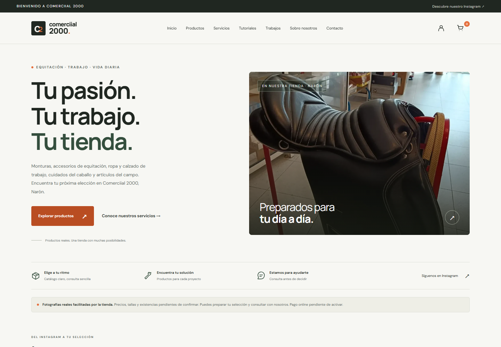

### 3.2. Catálogo

Muestra inicialmente 12 fichas, filtros por categoría, buscador y ordenación. Los precios desconocidos aparecen como «Consultar precio».

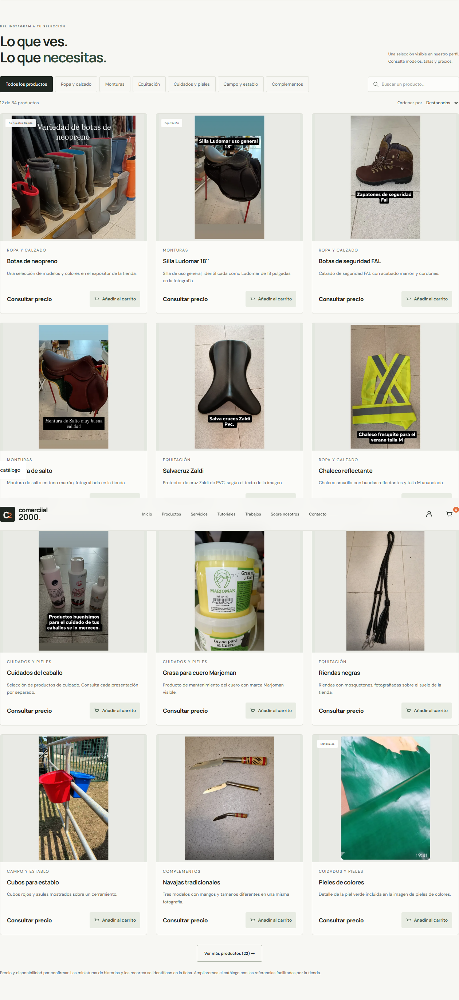

### 3.3. Servicios

Equitación y accesorios, arreglos y pieles, y ropa de trabajo. Las acciones conducen al catálogo filtrado o a preparar una consulta.

La tarjeta de Ropa de trabajo muestra la foto sin oscurecerla y funciona como un enlace completo: pulsar la imagen, el título o el texto abre la categoría Ropa y calzado.

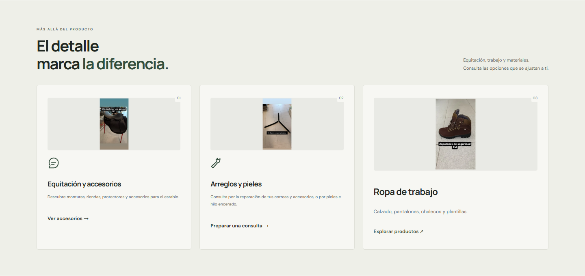

### 3.4. Tutoriales

Acceso a la historia destacada Tutoriales de Instagram. Actualmente los vídeos se consultan allí; no hay reproductores locales porque el material recibido no incluye archivos de vídeo.

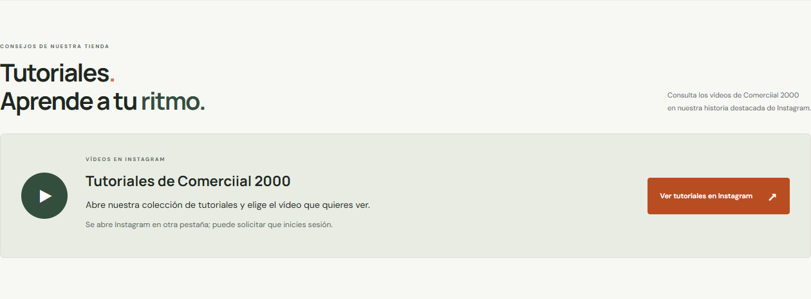

### 3.5. Galería

Ocho imágenes del local, correas, pieles, monturas y comunidad ecuestre. Cada fotografía se puede ampliar y recorrer con botones o flechas del teclado.

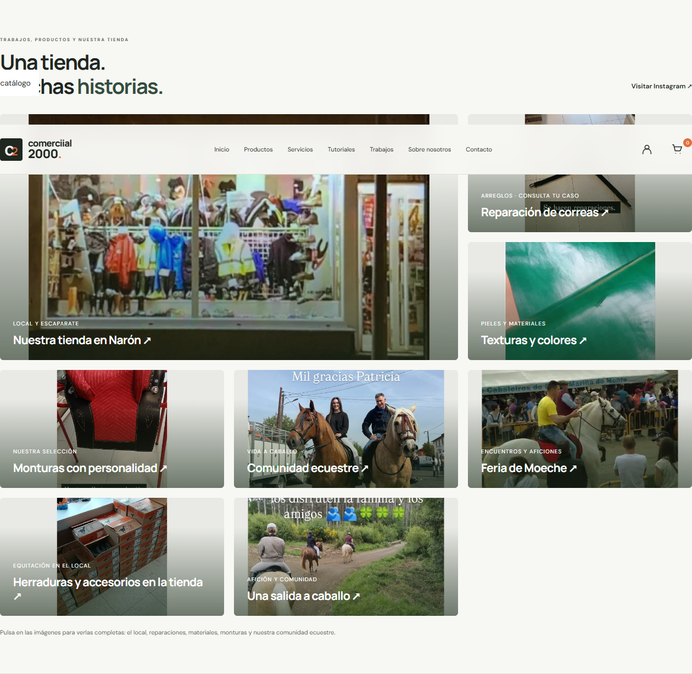

### 3.6. Tienda física

Fotografía completa del escaparate y presentación del negocio en **Rua Álvaro Paradela n.º 1, Narón**.

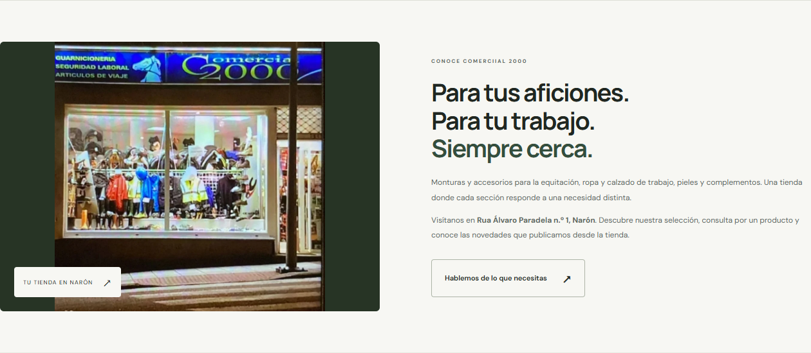

### 3.7. Contacto

Formulario de nombre, email y mensaje. Sin canal configurado, prepara texto para copiar y compartir; no afirma que se haya enviado.

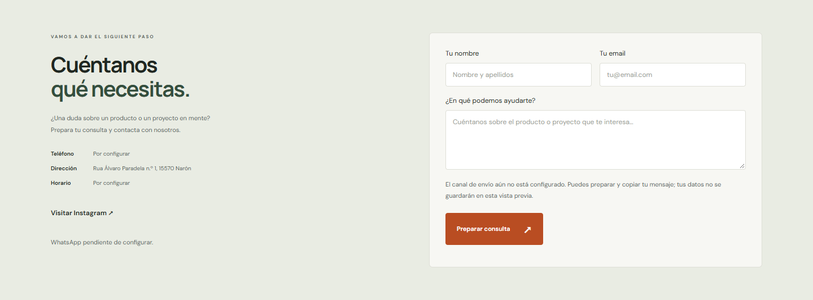

### 3.8. Ficha de producto

Imagen ampliada, descripción, especificaciones, miniaturas, enlace a la foto completa y acceso a la fuente. El detalle de botas se identifica como recorte de la misma fotografía.

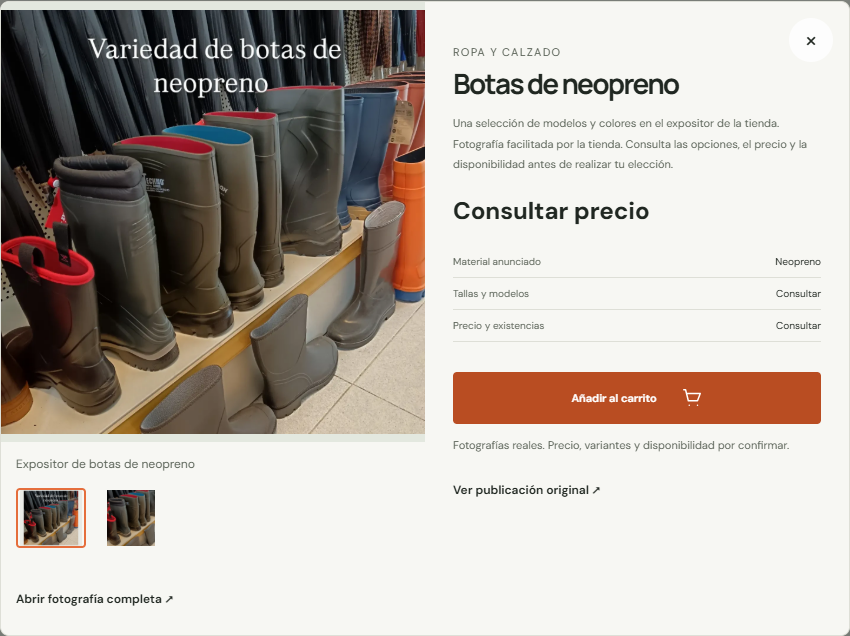

### 3.9. Carrito y resumen de selección

Las capturas muestran botas de neopreno y una silla Ludomar. Las cantidades son editables y los importes se mantienen «A confirmar».

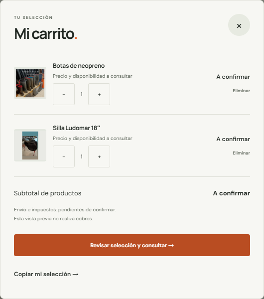

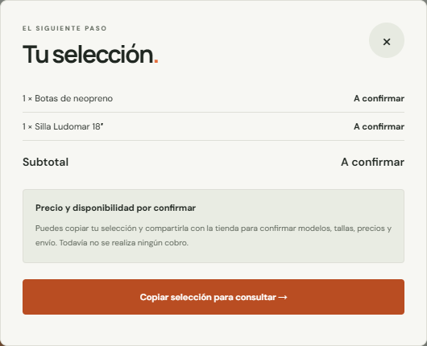

### 3.10. Experiencia móvil

Portada adaptable y menú desplegable con acceso a las siete secciones. El menú también se usa en tablets de hasta 1000 px.

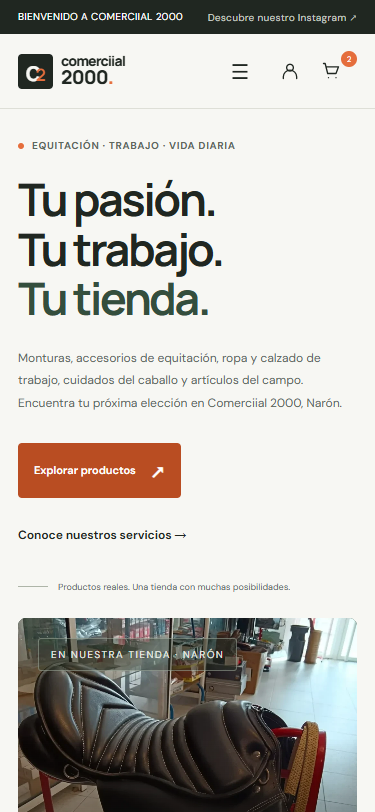

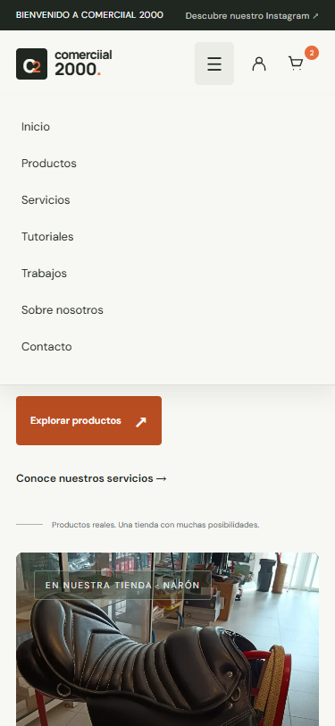

## 4. Funcionalidades

| Área | Qué permite demostrar | Estado actual |
| --- | --- | --- |
| Navegación | Saltar a las secciones y desplegar el menú móvil/tablet | Operativa; alternativa visible sin JavaScript |
| Catálogo | Explorar las 34 fichas y cargar 12, 24 y finalmente 34 | Operativo |
| Filtros | Monturas, Equitación, Ropa y calzado, Cuidados y pieles, Campo y establo, Complementos | Operativos sobre el catálogo completo |
| Búsqueda | Buscar nombres y contenido sin distinguir tildes o mayúsculas | Operativa |
| Ordenación | Destacados y nombre | Operativa; precio desactivado mientras todos los importes son desconocidos |
| Fichas | Abrir imágenes, consultar especificaciones y seguir la fuente | Operativas |
| Carrito | Añadir, cambiar cantidades, eliminar, conservar tras recarga y sincronizar entre pestañas | Operativo si el almacenamiento local está disponible |
| Resumen | Revisar y copiar la selección para preguntar a la tienda | Operativo, sin cobros ni pedidos |
| Galería | Ampliar y recorrer ocho fotografías | Operativa |
| Tutoriales | Abrir la historia destacada verificada de Instagram | Enlace operativo; reproducción dentro de la web pendiente de MP4/WebM |
| Contacto | Validar campos y preparar/copiar una consulta | Preparación local; envío pendiente de configurar |
| Cuenta | Informar sobre la experiencia como invitado | Sin registro, autenticación ni historial de pedidos |

El límite de selección de **99 unidades** es un control de la interfaz, no una confirmación de disponibilidad. Precios y stock en `null` significan «desconocido», no cero.

## 5. Recorrido guiado

**Duración orientativa: 6–8 minutos.** Inicia la presentación en `http://localhost:3000`.

| Paso | Acción del presentador | Resultado esperado |
| --- | --- | --- |
| 1. Presentar la tienda | Mostrar portada, fotografía real y aviso del catálogo | Se entiende la actividad y el estado de la demo |
| 2. Explorar productos | Pulsar «Explorar productos» | Acceso al catálogo con 12 fichas iniciales |
| 3. Filtrar monturas | Seleccionar «Monturas»; después probar «Ver monturas» en el banner | Ambos accesos muestran la misma categoría |
| 4. Buscar | Volver a «Todos los productos» y escribir `neopreno` | Aparece la ficha Botas de neopreno |
| 5. Abrir una ficha | Pulsar la foto o el nombre; seleccionar la segunda miniatura | Se muestra el detalle identificado como recorte y se actualiza el enlace a la foto completa |
| 6. Preparar la selección | Añadir botas; cerrar la ficha, limpiar la búsqueda y añadir Silla Ludomar | El contador del carrito refleja los artículos |
| 7. Revisar el carrito | Abrirlo, aumentar una cantidad y recargar la página | La selección se conserva; no se inventa un subtotal |
| 8. Mostrar la consulta | Pulsar «Revisar selección y consultar» y «Copiar selección para consultar» | Texto listo para compartir, sin pedir una tarjeta ni confirmar un pedido |
| 9. Mostrar contenido visual | Recorrer Servicios y Galería; ampliar una foto y usar las flechas | Navegación entre fotos completas; cierre con Escape |
| 10. Visitar tutoriales y tienda | Mostrar Tutoriales y Sobre nosotros | Enlace al destacado de Instagram y dirección del local |
| 11. Preparar contacto | Escribir `Demostración`, `demo@example.com` y una consulta de ejemplo; pulsar «Preparar consulta» | Texto preparado para copiar; no se envía en la configuración actual |
| 12. Cerrar en móvil | Reducir la ventana o usar vista de 375 px; abrir el menú | Diseño adaptable y acceso a todas las secciones |

Si el navegador deniega el portapapeles, se muestra el texto seleccionado para copiar manualmente. Instagram puede solicitar inicio de sesión: ese acceso pertenece al servicio externo.

Para repetir la presentación, elimina los artículos con los controles del carrito. No es necesario borrar otros datos del navegador.

## 6. Integración visual con Instagram

**Perfil oficial:** [@comerciial2000](https://www.instagram.com/comerciial2000/).

La integración actual es **visual y editorial**, mediante fotografías locales y enlaces a las fuentes; no es un feed sincronizado ni una conexión autenticada con la API de Instagram.

- **Portada:** montura negra fotografiada en la tienda.
- **Catálogo:** sección «DEL INSTAGRAM A TU SELECCIÓN», con miniaturas y fichas basadas en el contenido verificado.
- **Servicios:** fotografías relacionadas con equitación, arreglos y ropa de trabajo.
- **Galería:** escaparate, materiales, productos y comunidad, sin presentar todas las imágenes como trabajos realizados por la empresa.
- **Tutoriales:** enlace a [la historia destacada Tutoriales](https://www.instagram.com/stories/highlights/17878004970056771/), identificado en el HTML facilitado.
- **Fuentes:** perfil o publicación original accesibles desde las fichas.

Las copias locales evitan depender de enlaces temporales del CDN de Instagram. Las versiones WebP y miniaturas se conservan en `assets/`; los recortes y las miniaturas originales se identifican en la interfaz. La carpeta de originales anterior fue vaciada por petición del usuario, pero las copias de la web siguen disponibles.

Guardar una historia como HTML no conserva necesariamente su vídeo. La carpeta `Tutoriales/` incluye un reproductor con URL temporal `blob:`, sin archivo MP4/WebM recuperable. Su situación se explica en [TUTORIALES.md](TUTORIALES.md).

La procedencia visual se documenta en [FOTOS.md](FOTOS.md), [INSTAGRAM.md](INSTAGRAM.md), [el manifiesto local](assets/local-photo-sources.json) y [el manifiesto de Instagram](assets/instagram-sources.json).

## 7. Notas técnicas

### Arquitectura

Proyecto con **Node.js 22+, módulos ESM nativos y sin dependencias de ejecución ni paso de compilación**.

```text
mi-proyecto/
├── index.html          Estructura, secciones y diálogos
├── styles.css          Diseño responsive y estados visuales
├── app.js              Filtros, fichas, carrito, galería y contacto
├── catalog.js          Datos públicos compartidos por servidor y navegador
├── commerce.mjs        Validación de selección y recuperación del carrito
├── storefront.mjs      HTML compartido de tarjetas y galería
├── server.mjs          Servidor HTTP, recursos permitidos y API
├── assets/             Fotografías optimizadas y manifiestos
├── tests/              Pruebas Node
├── docs/demo/          Las doce capturas de esta presentación
└── DEMO.md             Documento de demostración
```

### Renderizado y persistencia

- El servidor entrega las 34 fichas y ocho enlaces de galería en el HTML inicial. Sin JavaScript se pueden consultar las fotos; filtros y carrito requieren el script.
- El navegador activa carga progresiva, búsqueda, diálogos y selección de productos.
- El carrito se guarda con la clave `comerciial2000-cart-v1` en `localStorage`; si ese almacenamiento está bloqueado, funciona en memoria durante la sesión de página.
- El resumen se actualiza cuando cambia el carrito desde otra pestaña.
- El adaptador opcional de Stripe verifica el retorno en servidor. La selección solo se vacía automáticamente cuando coinciden el pago verificado, la sesión iniciada en esa pestaña y los artículos enviados, registrados temporalmente en `sessionStorage`.

### API y configuración

| Ruta | Uso | Comportamiento de la demo |
| --- | --- | --- |
| `GET /api/status` | Estado de catálogo, pago y contacto | Pago y envío de contacto desactivados |
| `POST /api/checkout` | Validar selección e iniciar checkout si está configurado | No cobra; rechaza el inicio de pago sin configuración |
| `GET /api/payment-status` | Consultar una sesión con la pasarela | Sin pasarela activa no confirma pagos |
| `POST /api/contact` | Validar y entregar una consulta a un webhook HTTPS | Sin canal configurado no envía |

Las claves privadas pertenecen a `.env`, no a los módulos servidos al navegador. El servidor permite rutas públicas explícitas y no expone `.env`, código del servidor, documentación o archivos de pruebas. Escucha por defecto en `127.0.0.1:3000`.

Reinicia Node al cambiar `catalog.js`, `commerce.mjs`, `storefront.mjs`, `server.mjs` o `.env`. `PUBLIC_URL` debe coincidir con el origen real cuando se configure; se utiliza para metadatos y validación de solicitudes.

### Rendimiento, accesibilidad y SEO

- Miniaturas WebP, carga diferida en contenido inferior y prioridad alta para la portada.
- Las ocho miniaturas de galería suman 415.668 bytes frente a 1.314.330 de las versiones completas: aproximadamente un 68 % menos de datos de imagen en esas tarjetas.
- Revalidación de recursos con `ETag`/304 y alternativa local para imágenes que fallen.
- Menú desplegable hasta 1000 px, controles táctiles principales de al menos 44 px y campos de 16 px en móvil.
- Textos alternativos, estados de filtro, diálogos, foco visible y respeto a movimiento reducido.
- Descripción SEO, Open Graph y tarjeta social; canonical y URLs sociales absolutas cuando se configura `PUBLIC_URL`.
- Google Fonts es la dependencia visual externa. Fuentes locales, compresión de despliegue, URLs individuales de producto y métricas de producción son mejoras posteriores.

## 8. Verificación y próximos pasos

### Comprobaciones de esta demo

- **8 pruebas Node superadas** mediante `npm test`.
- **12 capturas actuales** generadas mediante navegador, con imágenes decodificadas y sin excepciones JavaScript durante el recorrido de captura.
- Comprobados catálogo inicial, filtro de monturas, ficha y recorte, carrito persistente, resumen sin pago y menú móvil a 375 px sin desbordamiento horizontal.
- Las auditorías anteriores cubren más tamaños, casos de fallo y sincronización entre pestañas; sus resultados y límites se detallan en [DIAGNOSTICO.md](DIAGNOSTICO.md).

Las capturas son una presentación de la versión actual, no una certificación de todos los navegadores ni una prueba de cobros reales.

### Pendientes de activación

| Prioridad | Pendiente |
| --- | --- |
| Antes de cobrar | Precios, stock, variantes, fiscalidad, envíos y condiciones de venta confirmados |
| Antes de operar pedidos | Pasarela elegida, pedidos persistentes, gestión de existencias y webhook de pagos firmado e idempotente |
| Contacto comercial | Teléfono, WhatsApp, email, horario y canal de envío reales |
| Vídeos locales | Originales MP4/WebM; configuración de entrega de vídeo y reproductores |
| Publicación | Dominio HTTPS, `PUBLIC_URL`, textos legales definitivos y pruebas en el alojamiento |

**Conclusión:** la demo permite presentar una experiencia completa de exploración, contenido visual y preparación de consultas. La activación de ventas reales requiere resolver los pendientes anteriores; no se han inventado precios ni habilitado cobros para la demostración.

---

**Documentación relacionada:** [README](README.md) · [Diagnóstico](DIAGNOSTICO.md) · [Fotografías](FOTOS.md) · [Instagram](INSTAGRAM.md) · [Tutoriales](TUTORIALES.md).
